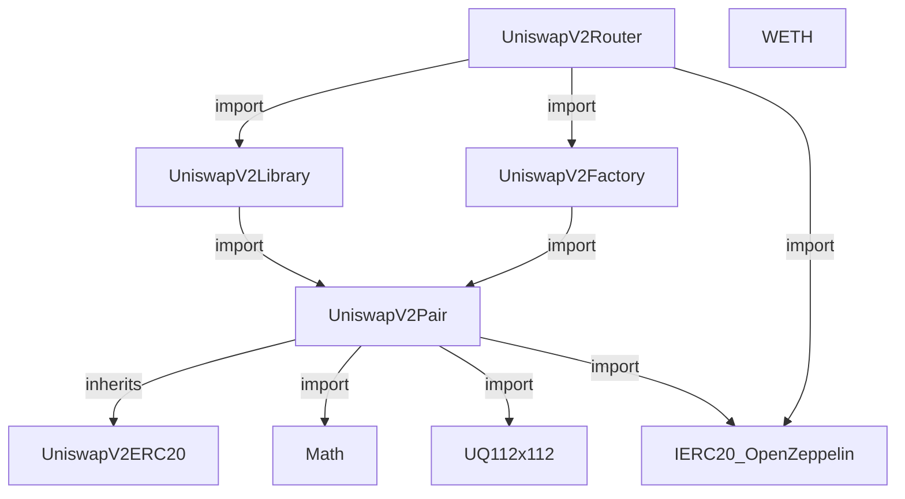
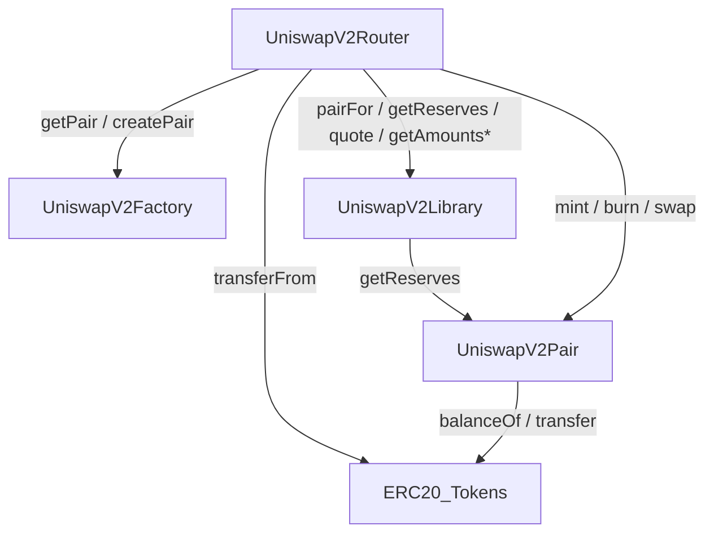
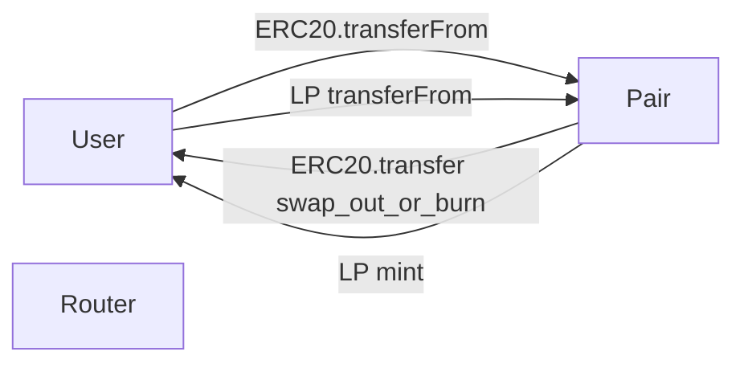
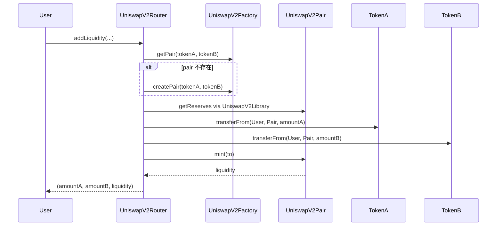
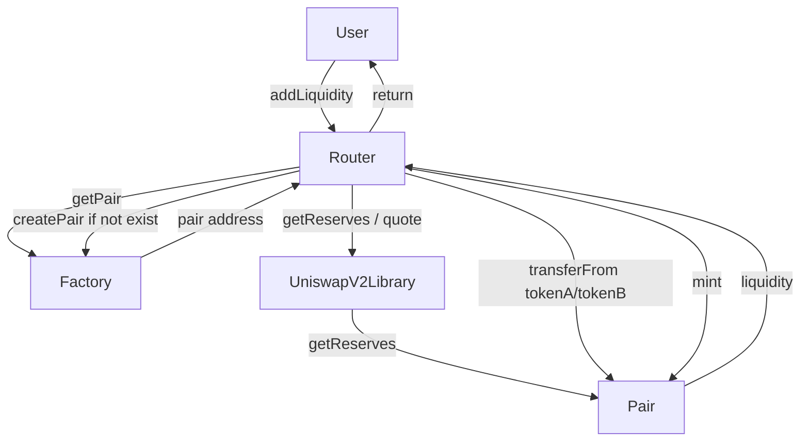
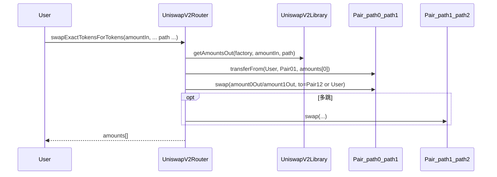
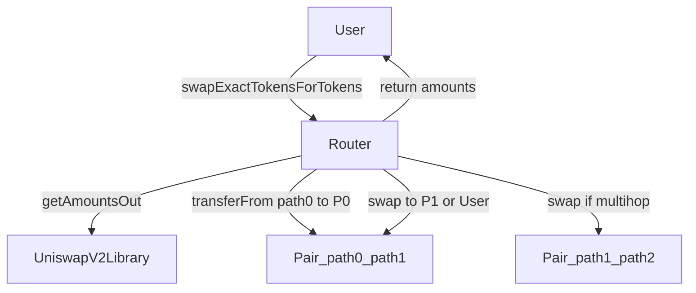

# Uniswap V2（本仓库版本）代码学习文档

本目录是对 `contracts/contracts/uniswap-v2` 下各合约/库的逐文件说明（每个文件一个独立文档），并提供总览与关系图。

## 模块概述（每个模块的作用）

- **UniswapV2Factory**
  - 负责创建与管理交易对（Pair）。
  - 维护 `tokenA-tokenB -> pair` 的映射，并提供 `getPair/createPair` 等入口。
- **UniswapV2Pair**
  - 单个交易对的核心合约，保存两种代币的储备量（reserves），并实现：
    - 添加/移除流动性：`mint` / `burn`（铸造/销毁 LP 份额）。
    - 交易：`swap`（按恒定乘积与手续费规则完成兑换）。
  - 也是 LP Token 的发行者（继承 ERC20 实现 LP 代币）。
- **UniswapV2ERC20**
  - 为 Pair 提供 LP Token 的 ERC20 基础实现（余额、转账、授权等）。
- **UniswapV2Router**
  - 面向用户/外部的“组合式入口”。
  - 负责把用户意图（加池、撤池、单跳/多跳兑换）拆解为：查找/创建 Pair、计算报价、转账到 Pair、调用 Pair 的 `mint/burn/swap` 等步骤。
  - 本仓库 Router 偏精简：主要面向 ERC20-ERC20；ETH 相关入口不完整（详见备注）。
- **UniswapV2Library**
  - Router 的纯计算/查询辅助库。
  - 负责确定 Pair 地址（如 `pairFor`）、读取储备（`getReserves`）以及路径报价（`quote/getAmountsOut/getAmountsIn`）。
- **Math**
  - Pair 的数学工具库（如最小值、平方根等），用于计算流动性份额、价格等中间量。
- **UQ112x112**
  - 定点数编码/运算工具（112.112 格式），主要用于价格累计值等精度相关计算。
- **WETH**
  - ETH 的包装代币实现（`deposit/withdraw` 把 ETH 与 ERC20 形式的 WETH 互转）。
  - 在完整 Uniswap V2 体系中用于支持 ETH 相关路由；本仓库 Router 仅保留了 WETH 地址字段但入口不全。
- **IERC20（OpenZeppelin）**
  - 标准 ERC20 接口类型，Router/Pair 用它与任意代币合约交互（`transfer/transferFrom/balanceOf` 等）。

## 推荐阅读顺序

1. `UniswapV2ERC20.md`
2. `UniswapV2Pair.md`
3. `UniswapV2Factory.md`
4. `libraries/Math.md`
5. `libraries/UQ112x112.md`
6. `libraries/UniswapV2Library.md`
7. `UniswapV2Router.md`
8. `WETH.md`

## 文档索引

- [UniswapV2Factory](./UniswapV2Factory.md)
- [UniswapV2Pair](./UniswapV2Pair.md)
- [UniswapV2ERC20](./UniswapV2ERC20.md)
- [UniswapV2Router](./UniswapV2Router.md)
- [WETH](./WETH.md)
- [Math](./libraries/Math.md)
- [UQ112x112](./libraries/UQ112x112.md)
- [UniswapV2Library](./libraries/UniswapV2Library.md)

## 图示：依赖 / 调用 / 资金流

说明：为了避免一张图信息过载，这里把关系拆成三类图。

### 1) 依赖关系图（import / inherit）

注：`IERC20_OpenZeppelin` 表示 `@openzeppelin/contracts/token/ERC20/IERC20.sol`。

### 2) 调用关系图（runtime call）

注：`ERC20_Tokens` 表示任意标准 ERC20 代币合约实例。

### 3) 资金流图（token flow）

## 典型交互流程图

### 添加流动性（`addLiquidity`）

### 代币交换（`swapExactTokensForTokens`）

## 备注

- 本仓库 Router 实现偏精简：虽然保存了 `WETH` 地址，但未提供 ETH 相关的 add/remove/swap 入口函数。
- Mermaid 渲染取决于你的 Markdown 渲染器（GitHub/部分 IDE 支持）。
